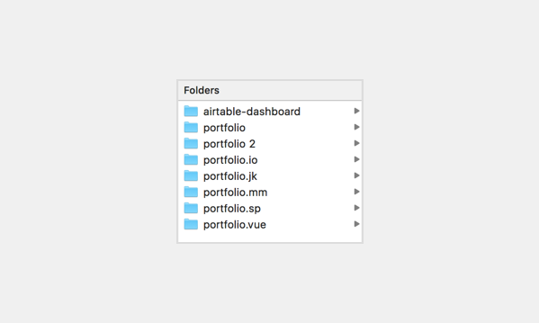

# CMS-less, and it feels great.
* front-end dev
* productivity

When it comes to Flat File CMSes vs. Static Site Generators vs. Wordpress vs. Squarespace vs. etc etc etc, I’m something of a moderate. I have an admittedly huge crush on the [Laravel](https://laravel.com/) ecosystem 😍, but honestly, I also love learning new things, and I’m always going to consider whatever’s best for the job. Every project has a different venn diagram of user needs, client needs, developer needs, and deployment complexities.

When I decided to (finally) focus on making my own website, I knew I wanted to publish it on GitHub Pages (who doesn’t love free hosting, right?), but that… was about it. I knew I wanted to manage a fair amount of content, but Wordpress seemed like overkill for a few case studies and a blog. [Statamic](https://statamic.com/) is my go-to for “Wordpress-light”, but it requires PHP, and I’d honestly rather write in my own favorite markdown editor than in a browser.


*If you find yourself writing a lot of markdown, and you aren’t using [Bear App](http://www.bear-writer.com/), you’re missing out.*

Lots of developers rave about Jekyll, and it comes with out of the box support from GitHub Pages, so I started there. I wasn’t jazzed about the number of plugins I needed in order to have multiple different kinds of “posts,” and ultimately, I found myself missing my webpack-based workflow for building assets, and ended up trying a few other frameworks.


*And by few, I guess I mean 7.* 😬

Middleman was by far my favorite of the static-site generators — ruby-based like Jekyll, but way more flexible with its asset pipeline. But as I started to include Vue elements, I realized that Middleman, too, was kind of overkill. Eventually, I realized that all I really wanted was to import some markdown files into a handful of Vue components.

So, with the help of [markdown-loader](https://www.npmjs.com/package/markdown-loader) that’s what I ended up doing.

Since I try to keep my “Work” page pretty curated, it’s not hard to simply update the Vue component to grab another markdown file when I finish writing one. That file looks like this:

```
<script>
export default {
  name: 'hi',
  data () {
    return {
      index: [
        'cat-merrick-studios',
        'texas-millennial-institute',
        // 'my-magic-mud', // <-- coming soon!
        'social-evolution',
        'at-the-fork-virtual-reality',
        // 'free-together'
      ]
    }
  },
  computed: {
    work: function() {
      var app = this
      var work = []

      for (var i in app.index) {
        var s = require(`../../../work/${app.index[i]}.md`)

        // Fix relative path issues with Marked's image import
        var w = s.replace(new RegExp('\/images', 'g'), 'images')

        work[i] = { index: i, slug: app.index[i], body: w }
      }
      console.log(work)
      return work
    }
  },
  methods: {}
}
</script>
```

The blog is a little trickier: you don’t want your client-side javascript to be able to traverse a directory (for obvious security reasons), but there’s going to be enough content there that it’s going to get annoying to track individually.

Since you *can* ask Webpack to do a little file-requiring during the build, as long as you explicitly tell it which files to grab, I wrote a simple node script that compiles a JSON directory of the blog posts and iterate through that during build:

```
var fs = require('graceful-fs')
var path = require('path')
var posts = []

var list = fs.readdirSync('./blog')

for (p in list) {
  var filename = list[p]

  // Only get markdown files, not folders
  if (path.extname(filename) == '.md') {
    var stats = fs.statSync('./blog/' + filename)
    var date = stats.mtime

    posts[p] = {}
    posts[p].date = date
    posts[p].path = filename
  }
}

fs.writeFileSync('blog/manifest.json', JSON.stringify(posts))
```

And, tada! Simple, fast, blog-aware-ish, vue-based site that lives on GitHub Pages.

Next up, I’d like to add a blog-aware URL structure for Vue Router, so each post and work item can have it’s own permalink.