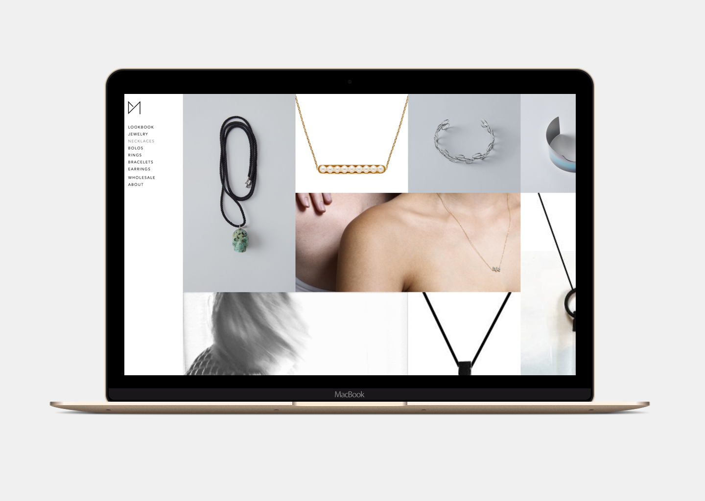

# Cat Merrick Studios
* user experience design
* visual design
* branding
* front-end dev

> **Cat’s Evaluation:**  
> “I couldn't be happier. Expectations blown out of the water.”  

UI design in the high-fashion world is very complex. As Cat — a super friendly, brilliant industrial designer who’s breaking into the jewelry scene later this year — explained to me, there is a very weird and nebulous line to balance between minimalism and usability. Sites are designed to be minimalist, sparse, and in some cases, outright confusing — *on purpose.*

For me, it was an unfamiliar journey into a world that really hinges on the theme, “If you have to ask, you can’t afford it.”

I was immediately drawn to Cat’s project — an online store for her new jewelry line — because of this dynamic. Cat herself is warm, open, friendly, brimming with creativity and gusto and tech-industry-like disruptiveness. It’s a huge part of her brand, her work, and her style. But the industry she’s about to disrupt is stark, minimalist, and has a bit of a “fuck you” attitude to outsiders and those who don’t immediately come across as “one of them.”

What an awesome and interesting design challenge.

## The Requirements
1. Cat wanted to be able to showcase her products by type, but didn’t want her shop to feel too sparse by splitting things up into groups.

2. She wanted the site to be easy to understand and navigate, but not feel out of place among websites that adhered to extreme minimalism, sometimes at the expense of what we both recognized as usability best practices.

3. She wanted to be able to use gifs and videos as the “featured” image for products, which is a feature Shopify doesn’t support out of the box.

4. She wanted to have a password-protected wholesale version of some, but not all, of the products.

5. She needed to be able to maintain all of this on her own, with limited tech experience.

## The Designs
The first round of design included elements (above) with bold Geomanist font, dramatic diagonals, and interesting product photography. The basic elements of Cat’s in-progress brand were there — monochrome color scheme, focus on photography, geometric typeface — but it wasn’t quite right for her target audience. All of Cat’s pieces are hand-designed and individually crafted, and the big-box-store UX patterns had far too much of a “polished” and commercial feel.

On the UX and tech side, we were running into other technology tetris challenges: Cat wanted to have a password-protected wholesale section, with separate pricing structures for her products, and at some point in the future was considering opening up a home goods line. For non-bulk buyers, was a “wholesale” nav item distracting? What was the best way to organize products into categories and subcategories, and what was the best way to accomplish that in Shopify (which, we discovered, has significant security limitations when pulling product info via AJAX)?

Ultimately, we settled on a single-page design for the jewelry collection, split into sections. This felt like the best of both worlds: show the user all of Cat’s products to keep the page feeling full, but maintain organization and structure.

To keep load times down, I implemented some AJAX to dynamically load the next section as the user scrolled. And to keep time-on-site up, I added another “infinite-scroll” script to the single product page, plus some javascript to make the product information “sticky”:

Ultimately, I think what we built is going to be a huge success, and I can’t wait to see her line launch later this year.

