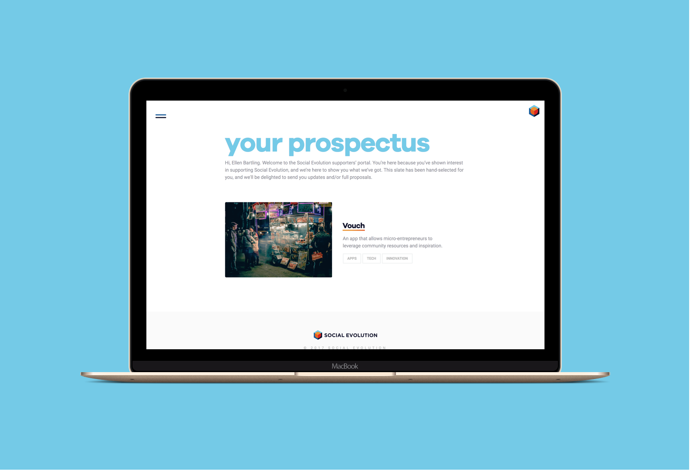

# Social Evolution
Finished Website: [Social Evolution](http://social-evolution.com/)

* user experience design
* visual design
* front-end dev

## The Requirements
1. A front-facing website that shows (and tells) the story of a disruptive, tech-focused non-profit that’s about to change the world.

2. A back-end, invite-only web app that gives users access to a curated list of projects they might be interested in supporting.

3. Customizable everything: colors, font-positioning, images, blend mode, blend intensity.

4. Fast, quickly deployable, and easy for non-tech users to edit & add content to.
